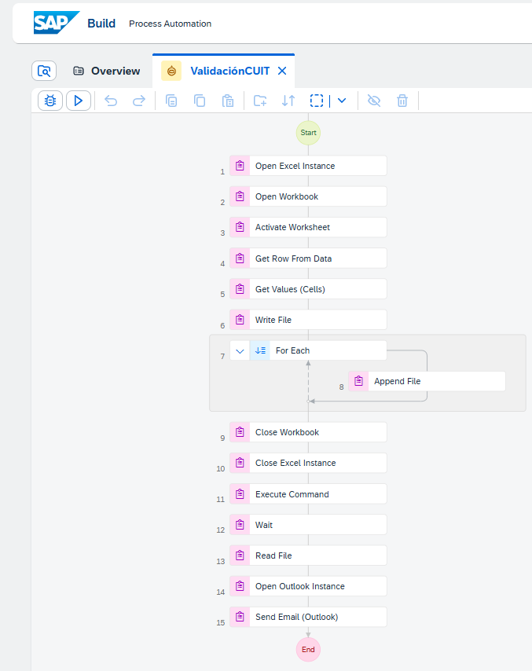
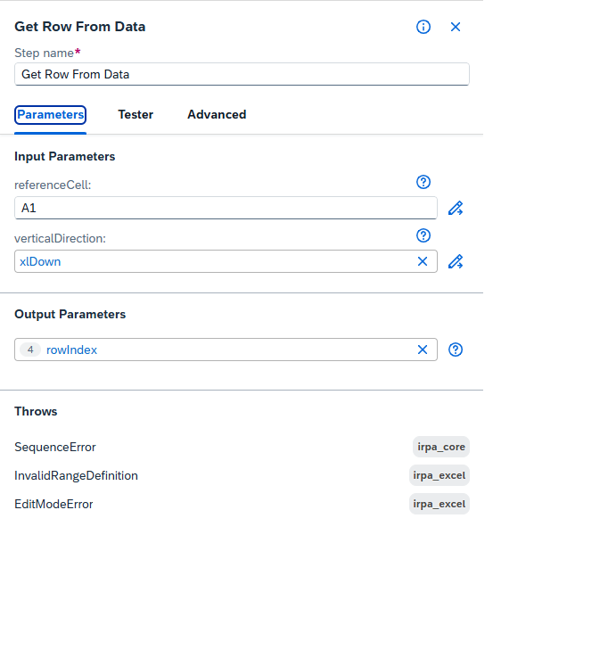
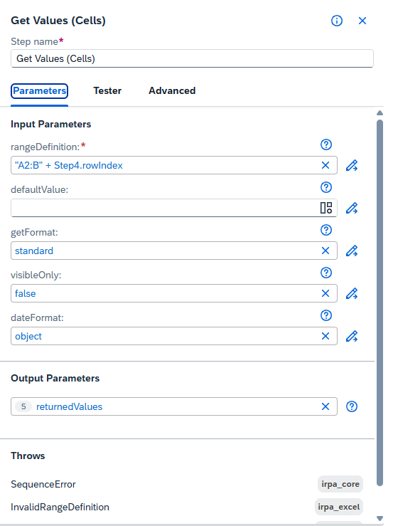
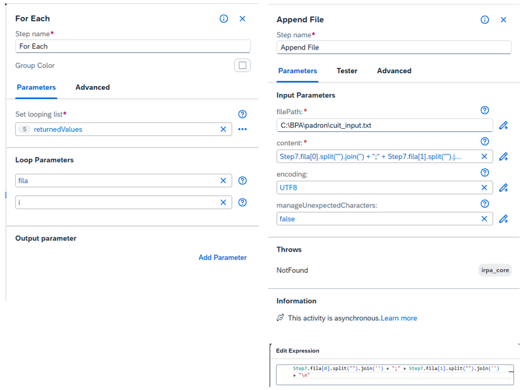
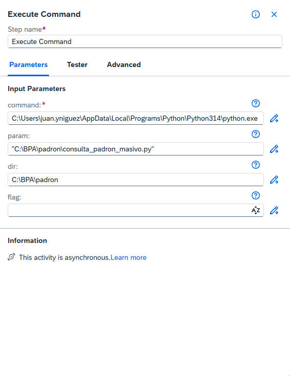
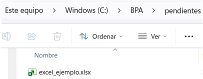
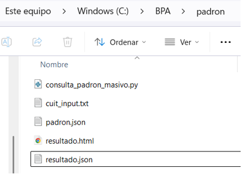
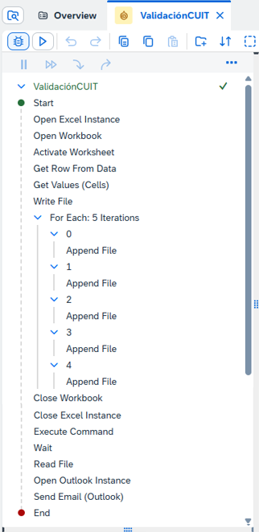
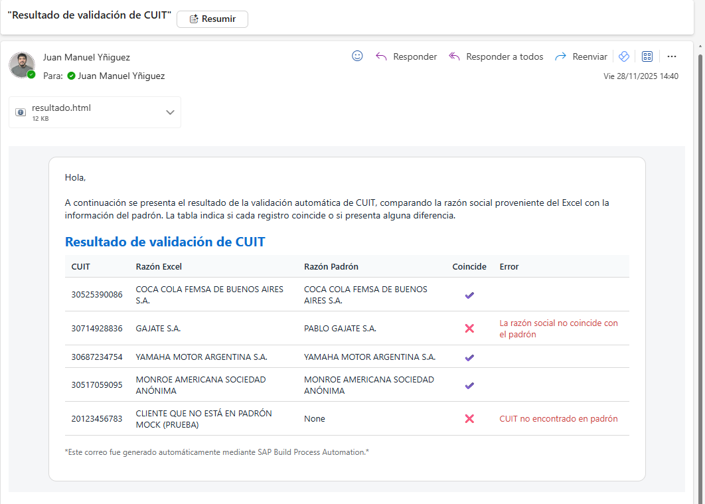

# 📘 Validacion Masiva de CUIT con SAP Build Process Automation + Python

Automatizacion desarrollada como caso real de uso en **SAP Build Process Automation (BPA)**, integrando lectura de Excel, construccion dinamica de archivos, ejecucion de un script de **Python**, analisis masivo de informacion del padron y envio automatico de resultados por correo electronico.

Este caso demuestra una arquitectura hibrida completa BPA + Python que puede aplicarse a validaciones masivas, transformaciones de datos, procesos batch y automatizacion asistida.

---

# 📚 Contenido

- [Descripcion General](#descripcion-general)
- [Arquitectura del Proceso](#arquitectura-del-proceso)
- [Workflow Completo](#workflow-completo)
- [Lectura del Excel](#lectura-del-excel)
- [Iteracion con For Each](#iteracion-con-for-each)
- [Generacion del Archivo de Entrada](#generacion-del-archivo-de-entrada)
- [Ejecucion del Script Python](#ejecucion-del-script-python)
- [Archivos de Entrada y Salida](#archivos-de-entrada-y-salida)
- [Logs de Ejecucion](#logs-de-ejecucion)
- [Email Automatico](#email-automatico)
- [Snippets Tecnicos](#snippets-tecnicos)
- [Buenas Practicas](#buenas-practicas)

---
<a id="descripcion-general"></a>
# 📝 Descripcion General

La automatizacion realiza:

1. Lectura dinamica de un archivo Excel que contiene CUITs y razones sociales.
2. Determinacion automatica del rango real a procesar.
3. Construccion de un archivo `cuit_input.txt`.
4. Ejecucion de un script Python (`consulta_padron_masivo.py`).
5. Lectura del archivo resultante generado por Python.
6. Envio de un correo electronico con una tabla HTML consolidada.

---
<a id="arquitectura-del-proceso"></a>
# 🏗️ Arquitectura del Proceso

```
Excel → BPA (Read + For Each + Append File) → Python Script → BPA (Read File) → Outlook Email
```

---
<a id="workflow-completo"></a>
# 🔁 Workflow Completo



---
<a id="lectura-del-excel"></a>
# 📥 Lectura del Excel

## Get Row From Data



- `referenceCell: A1`
- `verticalDirection: xlDown`
- Output: `rowIndex`

---

## Get Values (Cells)



Expresion utilizada:

```txt
"A2:B" + Step4.rowIndex
```

---
<a id="iteracion-con-for-each"></a>
# 🔄 Iteracion con For Each



- Lista iterada: `returnedValues`
- Parametro del loop: `fila`

---
<a id="generacion-del-archivo-de-entrada"></a>
# 📄 Generacion del Archivo de Entrada

Expresion utilizada para construir cada linea:

```txt
Step7.fila[0].split("").join('') + ";" + Step7.fila[1].split("").join('') + "\n"
```

Ejemplo de salida:

```
30525390086;COCA COLA FEMSA DE BUENOS AIRES S.A.
30714928836;GAJATE S.A.
```

---
<a id="ejecucion-del-script-python"></a>
# 🐍 Ejecucion del Script Python



```txt
command: C:\Users\juan.yniguez\AppData\Local\Programs\Python\Python314\python.exe
param: "C:\BPA\padron\consulta_padron_masivo.py"
dir: C:\BPA\padron
```

---
<a id="archivos-de-entrada-y-salida"></a>
# 📁 Archivos de Entrada y Salida

## Input Folder



Ubicacion: `C:\BPA\pendientes\excel_ejemplo.xlsx`

---

## Output Folder



Archivos generados:

- `cuit_input.txt`
- `padron.json`
- `resultado.html`
- `resultado.json`

---
<a id="logs-de-ejecucion"></a>
# 📊 Logs de Ejecucion



Muestra:

- Iteraciones del For Each
- Una sola ejecucion del comando Python
- Envio automatico del email

---
<a id="email-automatico"></a>
# 📧 Email Automatico



Incluye tabla HTML con:

- CUIT  
- Razon Social Excel  
- Razon Social Padron  
- Coincidencia  
- Error cuando aplica  

---
<a id="snippets-tecnicos"></a>
# 🧩 Snippets Tecnicos

## For Each – Content Expression

```txt
Step7.fila[0].split("").join('') + ";" + Step7.fila[1].split("").join('') + "\n"
```

## Get Values – Range Expression

```txt
"A2:B" + Step4.rowIndex
```

## Execute Command

```txt
command: C:\Users\juan.yniguez\AppData\Local\Programs\Python\Python314\python.exe
param: "C:\BPA\padron\consulta_padron_masivo.py"
dir: C:\BPA\padron
```

---
<a id="buenas-practicas"></a>
# 🧠 Buenas Practicas

- Usar rangos dinamicos para Excel.
- No ejecutar Python dentro del For Each.
- Generar el archivo TXT de entrada fuera del script.
- Mantener BPA y Python desacoplados mediante archivos.
- Utilizar UTF-8 para evitar caracteres inesperados.
- Documentar claramente rutas de entrada y salida.

---

**Desarrollado por Juan Manuel Yñiguez**
